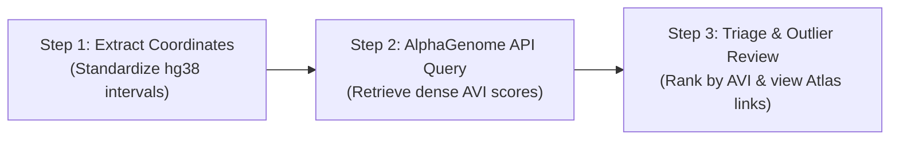

# Exploratory AlphaGenome Microprotein Screening Plan

## Overview
A streamlined, direct experiment to test the **AlphaGenome API** across human microproteins. 
Rather than applying complex multi-step filters or gating tiers upfront, we treat all candidates as **equals**:
1. Query their genomic coordinates across the AlphaGenome Atlas.
2. Calculate their **AlphaGenome Variant Impact (AVI)** constraint profile (median and peak Phred scores).
3. Identify the **outliers that stand out** (microproteins under strong negative selection or showing high-impact functional disruptions).
4. Provide direct clickable **AlphaGenome Atlas** links to visually inspect the standout hits in the browser.

---

## The 3 Streamlined Steps



### Step 1: Rapid Coordinate Extraction
- **Input**: `data/raw/supp_table11_orbl.xlsx` and `data/parsed/orfs.parquet`.
- **Action**: Extract the hg38 exonic intervals (`IntervalsWithStop`), strand, gene name, and ORF ID into a unified table.
- **Candidates**:
  - Full catalog: 7,264 non-canonical ORFs (ncORFs).
  - Target cohorts available for immediate query:
    * *Cohort A (Quick exploratory batch)*: Curated 84 Tier 1 peptideins or top 100 microproteins (~2-3 minutes total runtime).
    * *Cohort B (Full catalog batch)*: All 7,264 ncORFs (batched checkpointing).
- **Output**: `data/curated/microprotein_query_intervals.parquet`.

---

### Step 2: Direct AlphaGenome API Batch Query
- **Tooling**: `alphagenome.atlas` Python SDK via `uv run`.
- **API Call**:
  ```python
  from alphagenome.atlas import atlas
  from alphagenome.data import genome
  
  client = atlas.create(api_key)
  interval = genome.Interval(chrom, start_0_based, end_0_based)
  results = client.query_interval(interval, requested_scorers=['AVI_SCORE', 'AVI_SCORE_FEATURE_IMPORTANCE'])
  ```
- **Metrics Calculated per Microprotein**:
  - `median_avi_phred`: Background purifying selection across the coding sequence.
  - `max_avi_phred`: Peak deleterious hotspot mutation within the ORF.
  - `top_modality`: Leading biological mechanism driving impact (e.g. Splicing, Missense/AlphaMissense, RNA-seq, ChIP-TF).
- **Output**: `data/screening/microprotein_avi_scores.parquet`.

---

### Step 3: Outlier Ranking & Interactive Atlas Inspection
- **Action**: Sort all microproteins by `median_avi_phred` and `max_avi_phred`.
- **Outlier Highlights**:
  - **Top Constraint Tier** ($\text{Phred} \ge 20$ / Top 1% genome-wide impact): Microproteins whose codons are strictly conserved and functionally critical.
  - **Splicing & Regulatory Hotspots**: Candidates whose alteration triggers major splice disruptions or transcriptional shutdown.
- **Deliverables**:
  - A ranked summary table displaying:
    * ORF ID & Gene Symbol
    * Length (aa) & Biotype
    * Median AVI Phred & Max AVI Phred
    * Top Modality
    * **Direct Clickable AlphaGenome Atlas Link** for each standout candidate.
