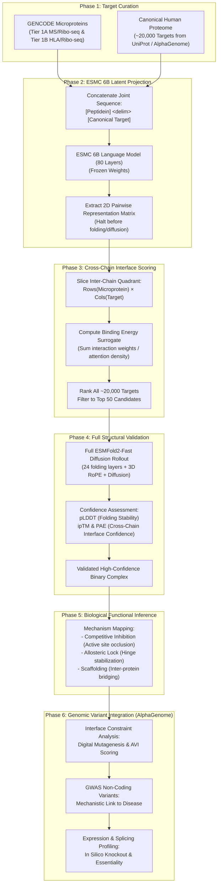

# A Computational Framework for Deorphanizing GENCODE Peptideins via ESMFold2 Latent Interface Screening

**Domain**: Computational Biology / Cell and Molecular Biology  
**Methodological Focus**: High-throughput binary interactome screening via ESMFold2 latent representations, generative diffusion validation, and AlphaGenome Atlas genomic variant integration.

---

## 1. The Biological Problem & Computational Bottleneck

Microproteins (typically <100–150 amino acids) translated from small open reading frames (smORFs) generally lack standalone enzymatic active sites. They primarily function through binary (microprotein–protein) interactions, acting as:
- **Allosteric regulators**
- **Competitive inhibitors**
- **Structural locks** for larger canonical proteins

To deduce a newly discovered microprotein's function, we must identify its binding partner. However, running an all-atom generative model on a single microprotein against the entire human canonical proteome (~20,000 targets) is computationally intractable (e.g., requiring ~263 continuous GPU-days for 121 microproteins using standard folding engines).

---

## 2. The Architectural Innovation

Instead of training a custom neural network from scratch, this pipeline "hijacks" the **ESMFold2** architecture.

By decoupling the model's internal biological knowledge:
1. **ESMC 6B Language Model Trunk**: Frozen 80-layer foundation model encoding biophysical, structural, and evolutionary constraints.
2. **Generative Rendering**: The computationally expensive 12-block atom diffusion module and recurrent folding layers.

We create an $\mathcal{O}(1)$ semantic filter to reduce the search space before running full 3D structural validation.

---

## 3. The Step-by-Step Pipeline

### Phase 1: Data Curation & Target Selection

Establish the high-confidence query and target datasets:

* **The Query Set (Microproteins)**:
  Extracted from newly annotated GENCODE microproteins, filtering for natively translated targets:
  * **Tier 1A** (12 peptideins): Confirmed by robust tryptic mass spectrometry (MS) and ribosome profiling (Ribo-seq).
  * **Tier 1B** (72 peptideins): Confirmed by HLA immunopeptidomics and Ribo-seq.
  * **Curated FASTA files**:
    - [`data/queries/tier1_peptideins.fasta`](../data/queries/tier1_peptideins.fasta): 84 high-confidence peptideins (Tier 1A + 1B).
    - [`data/queries/all_peptideins.fasta`](../data/queries/all_peptideins.fasta): 121 total annotated peptideins (Tiers 1A, 1B, 2A, 2B).
    - [`data/queries/tier1_all_microproteins.fasta`](../data/queries/tier1_all_microproteins.fasta): 711 total Tier 1 microproteins across all smORF biotypes.
    - [`data/queries/query_metadata.parquet`](../data/queries/query_metadata.parquet): Full annotation metadata table (748 unique ORFs).

* **The Target Set (Canonical Proteome)**:
  Standard human reference proteome retrieved directly from UniProt (UP000005640, canonical reviewed):
  * **Target FASTA**: [`data/targets/human_canonical_proteome.fasta`](../data/targets/human_canonical_proteome.fasta) (20,652 canonical proteins).
  * **Target Metadata**: [`data/targets/human_canonical_proteome.parquet`](../data/targets/human_canonical_proteome.parquet) (indexed by UniProt ID, gene symbol, protein name, length, and sequence).
  * **Raw Archive**: [`data/targets/raw/UP000005640_9606.fasta.gz`](../data/targets/raw/UP000005640_9606.fasta.gz) (7.73 MB).
  * **Curation Script**: [`scripts/phase1_curate_datasets.py`](../scripts/phase1_curate_datasets.py) (`python scripts/phase1_curate_datasets.py --all`).

---

### Phase 2: ESMC 6B Latent Projection (The Pre-Filter)

Bypass the generative folding steps of ESMFold2 to rapidly screen for binding compatibility:

1. **Sequence Concatenation**:
   For a given peptidein and a canonical target, concatenate their sequences with the appropriate inter-chain delimiter token used by ESMFold2.
2. **Language Model Forward Pass**:
   Pass the joint sequence through the 80 layers of the frozen ESMC 6B Cambrian language model ($d_{\text{model}} = 2560$).
3. **Extract the 2D Pairwise Representation**:
   Stop the model execution after the hidden states are combined via learned weights and projected into the 2D pairwise representation matrix. Do not pass this matrix into the recurrent folding layers or the sliding-window atom diffusion block.

---

### Phase 3: Cross-Chain Interface Scoring

Transform the 2D pairwise representation into a rapid ranking metric:

1. **Isolate the Interface**:
   The 2D pairwise matrix represents the model's internal prediction of residue-residue proximity. Computationally slice this tensor to isolate the specific quadrant representing the cross-chain interface (where the rows of the microprotein intersect the columns of the canonical target):
   $$\mathbf{M}_{\text{interface}} = \mathbf{M}_{1:L_{\text{micro}},\, L_{\text{micro}}+1:L_{\text{micro}}+L_{\text{target}}}$$
2. **Calculate Binding Energy Surrogate**:
   Sum the interaction weights/attention density across this inter-chain quadrant. A high density of predicted contacts indicates that ESMC 6B perceives high biophysical and evolutionary complementarity between the two surfaces:
   $$S_{\text{interface}} = \sum_{i=1}^{L_{\text{micro}}} \sum_{j=1}^{L_{\text{target}}} \mathbf{M}_{\text{interface}}(i, j)$$
3. **Candidate Ranking**:
   Rank the ~20,000 canonical targets based on this interface score. Reduce the target pool to a high-probability **Top 50** list. This reduces a multi-day compute task into a process taking only seconds to minutes per microprotein.

---

### Phase 4: Full Structural Validation

Utilize the full generative capabilities of ESMFold2-Fast on the filtered subset:

1. **Diffusion Rollout**:
   Run the peptidein paired with its Top 50 candidates through the complete ESMFold2-Fast architecture (including the 24 folding layers, 3D RoPE, and diffusion modules).
2. **Confidence Metrics Selection**:
   Extract the structural confidence metrics from the auxiliary Confidence Head:
   * **pLDDT (predicted Local Distance Difference Test)**: To ensure the microprotein is folding into a stable structure (like a helix or beta-hairpin) rather than just flopping as an unstructured loop.
   * **ipTM (interface predicted Template Modeling score) & PAE (Predicted Aligned Error)**: To strictly validate the confidence of the specific cross-chain physical interaction.
3. **Confirmation**:
   A high ipTM score provides computational proof of a stable microprotein–protein complex.

---

### Phase 5: Biological Functional Inference

Translate the structural finding into a biological hypothesis:

1. **Complex Contextualization**:
   Analyze the validated binary complex. If the targeted canonical protein is known to be part of a larger multi-subunit machine (e.g., a DNA repair complex or a metabolic supercomplex), hypothesis generation becomes straightforward.
2. **Determine the Modulatory Role**:
   Map the interface to see if the microprotein:
   * **Competitive Inhibition**: Occludes a known active site or catalytic cleft.
   * **Allosteric Lock**: Stabilizes a hinge region or dynamic conformational switch.
   * **Scaffolding**: Bridges two other proteins to assemble or stabilize a multi-protein complex.

---

### Phase 6: Genomic Variant Integration (AlphaGenome Atlas)

Bridge the gap between 3D structural predictions and human clinical genetics by mapping AlphaGenome Atlas variant impact data onto the validated complexes:

1. **Interface Constraint Analysis ("Digital Mutagenesis")**:
   Map the specific amino acids forming the physical binding interface (identified in Phase 4) back to their genomic DNA coordinates. Query these exact bases in the AlphaGenome Atlas. Exceptionally high AlphaGenome Variant Impact (AVI) scores at this interface provide evolutionary and clinical proof that this specific physical connection is critical for human health.

2. **Resolving GWAS "Non-Coding" Mysteries**:
   Cross-reference the genomic coordinates of the Tier 1 peptideins with known Genome-Wide Association Study (GWAS) disease variants. By mapping these high-AVI "non-coding" variants to the newly discovered structural function (e.g., disrupting the allosteric lock of a cancer-associated complex), this pipeline provides a direct molecular mechanism for unexplained genetic disease links.

3. **Expression & Splicing Disruption Profiling**:
   Utilize AlphaGenome's RNA-seq and splice-site disruption predictions to computationally simulate the knockout of the peptidein. Identifying highly deleterious splice-site variants that are entirely absent in healthy human populations serves as an *in silico* validation of the peptidein's biological essentiality.

