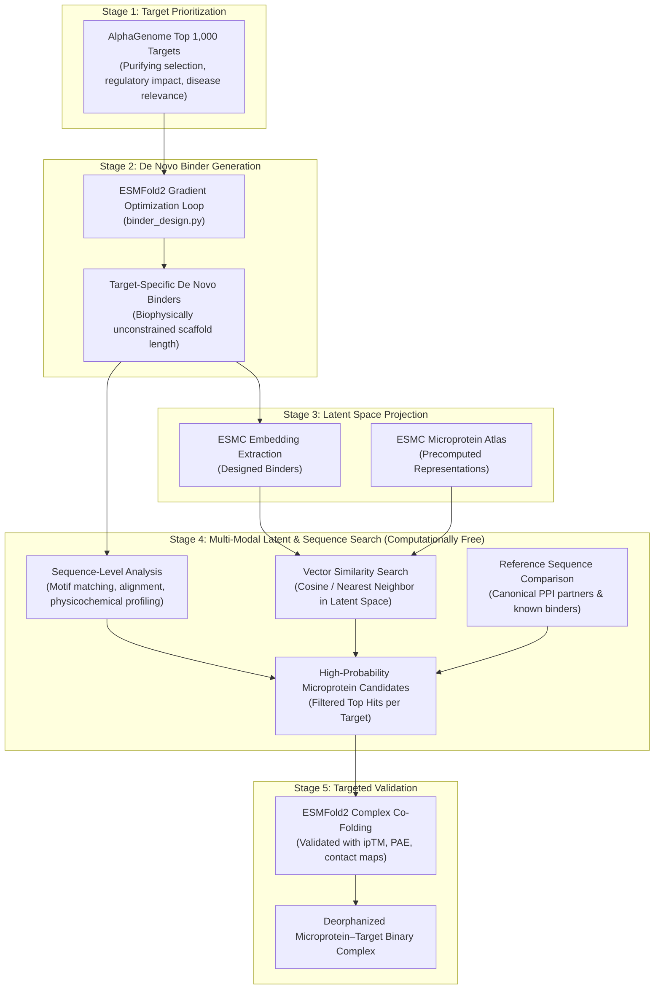

# Syn2Nat: De Novo Binder-Guided Latent Space Retrieval of Natural Microproteins for Protein–Protein Binding Prediction

**Method / Pipeline Moniker**: **Syn2Nat** (*Synthetic-to-Natural Latent Retrieval*)  
**Domain**: Computational Biology / Structural Interactomics / Foundation Protein Language Models  
**Methodological Focus**: Circumventing the combinatorial $\mathcal{O}(N \times M)$ interactome bottleneck via *de novo* binder generation, ESMC latent space projection, multi-modal sequence comparison, and targeted ESMFold2 structural validation.

---

## 1. Executive Overview & Problem Definition

### The $\mathcal{O}(N \times M)$ Computational Bottleneck
Directly deorphanizing non-canonical microproteins by structural complex co-folding across all possible human target proteins is computationally intractable:
$$\text{Search Space} = N_{\text{microproteins}} \times M_{\text{canonical targets}}$$
Evaluating even a curated library of $10^4$ microproteins against $10^3$ prioritized human targets requires **$10^7$ all-atom binary complex co-folding simulations** (e.g., ESMFold2 or AlphaFold-Multimer). On single-GPU infrastructure, this would require years of continuous compute and is prone to high false-positive rates from unconstrained structural docking.

### The Inverted Strategy
Rather than testing every microprotein against every target, we invert the direction of discovery:
1. **Prioritize high-impact targets** from the **AlphaGenome Top 1,000 list**.
2. **Generate *de novo* binders** for each prioritized target using the Biohub ESMFold2 gradient-guided optimization protocol. These synthetic binders serve as optimal biophysical "fingerprints" for the target interface.
3. **Embed binders in ESMC latent space**, matching the representation pipeline already established for the microprotein library.
4. **Query the latent and sequence search space** to discover natural microproteins whose representations or sequence profiles align with the designed binders.
5. **Validate only top candidates** with high-resolution ESMFold2 co-folding, achieving orders-of-magnitude reduction in required compute.

---

## 2. Core Methodological Pillars

### Pillar I: Target Prioritization via AlphaGenome Top 1,000
Targets are selected using genomic and functional criteria derived from the DeepMind AlphaGenome Atlas:
- **Variant Purifying Selection**: Targets prioritized by high dense AlphaGenome Variant Impact (AVI) scores, identifying genes intolerant to mutation.
- **Regulatory Importance**: Genes with high functional transcription-factor connectivity and cell-type specific epigenetic importance across GTEx tissues.
- **Disease & Therapeutic Relevance**: Focus on high-value human targets (immune checkpoints, oncogenic kinases, phosphatase regulators).

### Pillar II: De Novo Binder Generation & Biological Integrity
For each selected target, *de novo* binders are designed using the gradient-guided optimization protocol implemented in `binder_design.py`:
- **Optimization Objective**: Joint loss combining intra-chain contact, inter-chain contact, globularity, and epitope distance constraints.
- **Critic Ensemble**: High-confidence scoring via ESMFold2 hero critics.
- **Principle of Biological Honesty (Scaffold Freedom)**:
  > [!IMPORTANT]
  > **No Artificial Size Forcing**: The binder length and scaffold architecture are **never** artificially constrained to match the length distribution of the microprotein database.
  > 
  > Imposing artificial length caps or forcing binders into arbitrary microprotein dimensions violates structural biology principles—the binder geometry must emerge naturally from the geometric, chemical, and steric requirements of the target epitope. Microproteins exhibit diverse interaction modes (from short linear motifs to structured helical bundles), and discovery must reflect real biophysics rather than forced dataset alignment.

### Pillar III: Latent Space Embedding via ESMC
Both synthetic binders and candidate microproteins are projected into the shared latent space of the **ESMC protein language model** (e.g., `biohub/ESMC-6B` or `biohub/ESMC-600M`):
- **Representation Type**: Penultimate layer representations capturing high-level structural semantics, surface electrostatic potential, and fold grammar.
- **Shared Coordinate Frame**: Because the same ESMC foundation model extracts embeddings for both sets, the latent vector space serves as a continuous, metric-grounded search space.

### Pillar IV: Multi-Modal Latent & Sequence Comparison ("Computationally Free" Search Space)
Because vector math and sequence analysis do not require GPU tensor operations or structural simulations, this stage is **virtually computationally free**. Thousands of comparisons, metric variations, and sweeps can be executed in seconds:

1. **Latent Representation Matching**:
   - Cosine similarity and Euclidean distance in ESMC embedding space.
   - $k$-Nearest Neighbors ($k$-NN) clustering around the designed binder's latent coordinates.
2. **Primary Sequence Analysis**:
   - Local motif alignment and sequence matching against designed binder sequences.
   - Physicochemical profiling: isoelectric point ($\text{pI}$), charge distribution, hydropathy index, and secondary-structure propensity.
3. **Canonical Sequence Cross-Referencing**:
   - Integrating actual known canonical protein sequences, endogenous ligand sequences, and database entries (e.g., PepBind, IntAct, HIPPIE) into the comparison loop to calibrate matches against known binding modes.

### Pillar V: Targeted Validation
Once the search space has been narrowed down from tens of thousands to a shortlist of top candidates (e.g., top 5–10 microproteins per target):
- Run **ESMFold2 all-atom cofolding** (`app.design` / `fold_all_atom`).
- Assess complex quality using the 4-pillar biophysical hierarchy:
  - $\text{ipTM} \ge 0.60$ (interface predicted TM-score).
  - Inter-chain PAE $< 10\text{ \AA}$.
  - Buried surface area and atomic contact geometry.
- Use the synthetic binder's $\text{ipTM}$ as a calibrated positive benchmark.

---

## 3. Advantages Over Conventional Approaches

| Dimension | Conventional All-vs-All Screening | De Novo Binder-Guided Latent Search |
| :--- | :--- | :--- |
| **Computational Complexity** | $\mathcal{O}(N \times M)$ ($10^6 - 10^7$ co-folds) | $\mathcal{O}(M_{\text{targets}})$ binder designs + $\mathcal{O}(1)$ vector search + $\mathcal{O}(k)$ co-folds |
| **Search Space Medium** | Discrete, noisy pairwise docking | Continuous ESMC representation manifold |
| **Design Integrity** | Constrained by arbitrary sequence bounds | Scaffold length dictated purely by target epitope biology |
| **Exploration Cost** | High GPU cost per hypothesis | Near-zero computational cost for latent/sequence sweeps |
| **Validation Efficiency** | High false-positive rate | High-prior candidates with interface-specific similarity |

---

## 4. Implementation Guidelines & Next Steps

1. **Target Selection**: Ingest the AlphaGenome top 1,000 list and extract priority epitope target sequences.
2. **Binder Execution**: Run `binder_design.py` on prioritized targets (on Colab GPU or local cluster) to generate candidate binder pools.
3. **Embeddings**: Ingest binder sequences into the existing ESMC embedding extraction pipeline.
4. **Similarity Engine**: Construct a fast vector index (e.g., FAISS or cosine distance matrix) comparing binder vectors to the microprotein atlas embeddings.
5. **Cofold Validation**: Queue top ranked microprotein–target pairs for definitive structural cofolding in ESMFold2.
