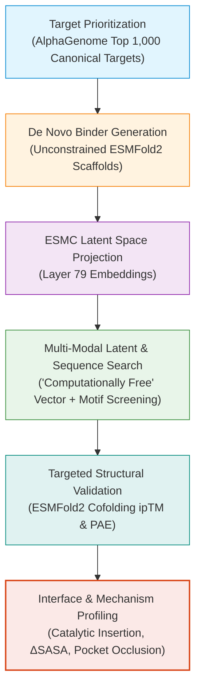

# Syn2Nat Empirical Benchmarks & Reports Portal

This directory serves as the centralized repository for all computed scientific reports, target prioritization datasets, and empirical structural benchmarks generated across the **Syn2Nat** discovery framework.

---

## 🎯 Syn2Nat Pipeline & Milestone Architecture

The benchmarks follow the inverted discovery paradigm:

---

## 📋 Active Reports & Benchmark Datasets

| Deliverable | Format / File | Focus & Scope | Status |
| :--- | :--- | :--- | :--- |
| **AlphaGenome Top 1,000 Target Selection** | [`canonical_proteome_alphagenome_top1000.tsv`](canonical_proteome_alphagenome_top1000.tsv) [`canonical_proteome_alphagenome_top1000.parquet`](canonical_proteome_alphagenome_top1000.parquet) | Prioritized high-value human targets from the AlphaGenome atlas based on dense purifying selection (AVI Phred scores), tissue epigenetics, and disease relevance. | `ACTIVE` |
| **Master Interface Site & Mechanism Atlas** | [**`interface_site_characterization_report.md`**](interface_site_characterization_report.md) [`interface_site_annotations_summary.tsv`](interface_site_annotations_summary.tsv) [`interface_site_annotations_summary.parquet`](interface_site_annotations_summary.parquet) | Exhaustive characterization across 1,812 complexes: catalytic active site insertion ($\le 5.0\text{ \AA}$), pocket occlusion, buried surface area ($\Delta\text{SASA}$), and PDBe-KB experimental overlap. | `ACTIVE` |
| **Pilot De Novo Binder Retrieval** | [`pilot_5_targets_binder_search.tsv`](pilot_5_targets_binder_search.tsv) [`pilot_5_targets_binder_search.parquet`](pilot_5_targets_binder_search.parquet) | End-to-end pilot validating latent-space and sequence-level matching of unconstrained synthetic binders against the microprotein catalog. | `BENCHMARK` |
| **15-Target Reverse Binder Matching** | [`reverse_binder_lookup_15_targets.tsv`](reverse_binder_lookup_15_targets.tsv) [`reverse_binder_lookup_15_targets.parquet`](reverse_binder_lookup_15_targets.parquet) | Reverse lookup evaluating cross-target specificity and multi-modal ranking across 15 high-priority human targets. | `BENCHMARK` |
| **Multi-Scale Binder Evaluation** | [`multiscale_binder_pilot_results.tsv`](multiscale_binder_pilot_results.tsv) [`multiscale_binder_pilot_results.parquet`](multiscale_binder_pilot_results.parquet) | Evaluation across varying unconstrained binder length regimes without artificial size forcing. | `BENCHMARK` |
| **Authentic Pockets Benchmark** | [`authentic_pockets_benchmark_results.tsv`](authentic_pockets_benchmark_results.tsv) [`authentic_pockets_benchmark_results.parquet`](authentic_pockets_benchmark_results.parquet) | Rigorous structural pocket validation comparing binder-predicted interaction footprints with native binding clefts. | `BENCHMARK` |
| **Continuous Cofolding Queue** | [`continuous_cofolding_candidates.parquet`](continuous_cofolding_candidates.parquet) | Streaming pipeline candidate queue for targeted structural co-folding validation. | `ACTIVE` |

---

## 🗄️ Local Archive: Exploratory Phase 1 Reports

> [!NOTE]
> Early exploratory analyses (the initial 5 milestone reports on genomic selection, hitchhiking proofs, Top 50 curation, and preliminary 805-complex tables) have been uncommitted from git and safely preserved locally in [`archive/exploratory_phase1/`](../archive/exploratory_phase1/) to maintain a clean, lightweight, production-grade repository focused on **Syn2Nat**.
>
> Preserved reports include:
> - `microprotein_multiomics_analysis_report.md` (Multi-omics hitchhiking proof)
> - `top50_curated_microprotein_portfolio.md` (Top 50 portfolio catalog)
> - `top50_microprotein_binding_partners_summary.md` (500 partner candidates dossier)
> - `esmfold2_cofolding_report.md` (Phase 1 batch screening)
> - `expanded_ppi_atlas_report.md` (805-complex master atlas)
> - All associated exploratory Parquet/TSV tables and PyMOL visualization scripts.
