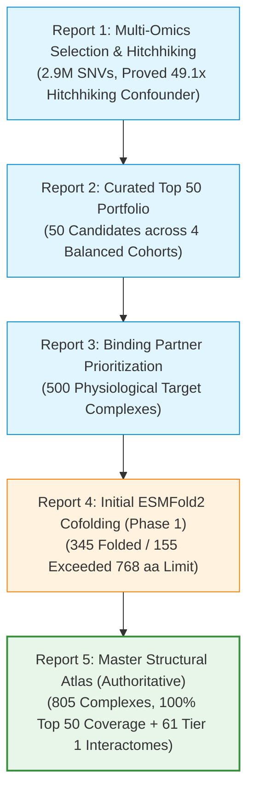

# Microprotein Empirical Reports & Milestone Index

This directory serves as the centralized repository for all computed scientific reports, statistical validations, and empirical structural milestones generated across the project.

---

## Chronological & Methodological Pipeline Index

The reports follow a progressive experimental workflow that moves from raw non-canonical genomic coordinates to 3D atomic-resolution macromolecular complexes:

---

## Detailed Report Summaries

| Report File | Title & Scope | Status | Key Deliverables & Artifacts |
| :--- | :--- | :--- | :--- |
| [**`microprotein_multiomics_analysis_report.md`**](microprotein_multiomics_analysis_report.md) | **Comprehensive Multi-Omics Characterization & Genomic Selection** • Scope: 7,264 human smORFs • 2,900,430 SNVs scored via AlphaGenome AVI | `COMPLETED` *(Exploratory)* | • Statistical proof of 49.1x CDS-overlapping hitchhiking confounder ($p < 10^{-300}$) • Definition of the Autonomous smORF benchmark ($n = 5,387$) • [`data/screening/microprotein_avi_scores.parquet`](../data/screening/microprotein_avi_scores.parquet) |
| [**`top50_curated_microprotein_portfolio.md`**](top50_curated_microprotein_portfolio.md) | **Curated Top 50 Human Microprotein Portfolio** • Scope: 50 prioritized candidates across 4 balanced cohorts | `COMPLETED` *(Baseline)* | • Stratified portfolio (Tier 1 autonomous, lncRNA-ORFs, 5' UTR uORFs, dual-coding) • Standardized CDS coordinates and biotype assignments • [`top50_curated_candidates.parquet`](top50_curated_candidates.parquet) |
| [**`top50_microprotein_binding_partners_summary.md`**](top50_microprotein_binding_partners_summary.md) | **Top 50 Microprotein Binding Partners Summary** • Scope: 500 candidate complexes (Top 50 $\times$ 10 partners) | `COMPLETED` *(Target Mapping)* | • 4-tier biological evidence curation (HIPPIE, BioGRID, IntAct, STRING) • Complete sequence pairs prepared for cofolding • [`top50_microprotein_binding_partners_top10.parquet`](top50_microprotein_binding_partners_top10.parquet) |
| [**`esmfold2_cofolding_report.md`**](esmfold2_cofolding_report.md) | **Initial Biohub ESMFold2 Cofolding (Phase 1)** • Scope: 500 candidate complexes screened on Biohub API | `INTERMEDIATE` *(Superseded)* | • 345 complexes successfully folded ($\le 768\text{ aa}$) • Identified 155 partner size bottlenecks exceeding interactive limit • *Note: See Report 5 for the complete remediated atlas* |
| [**`expanded_ppi_atlas_report.md`**](expanded_ppi_atlas_report.md) | **Master Microprotein–Protein Structural Atlas (805 Complexes)** • Scope: 805 full-atom cofolded complexes | `AUTHORITATIVE` *(Benchmark)* | • **100% Top 50 Portfolio coverage** (500/500 complexes) • Full Tier 1 peptidein interactome (305 complexes) • Discovery of nanomolar-like interfaces (`SNX13`–`SERPINE2` $\text{ipTM} = 0.8525$) • [`master_microprotein_ppi_structural_atlas.parquet`](master_microprotein_ppi_structural_atlas.parquet) • 805 PDBs in [`structures/pdbs/`](../structures/pdbs/) |

---

## Quick Reference: Authoritative Datasets & Outputs

* **Master Structural Table**: [`reports/master_microprotein_ppi_structural_atlas.parquet`](master_microprotein_ppi_structural_atlas.parquet) (805 rows, 35 metrics including ipTM, pTM, pLDDT, contacts, PAE).
* **Tab-Separated Table**: [`reports/master_microprotein_ppi_structural_atlas.tsv`](master_microprotein_ppi_structural_atlas.tsv).
* **3D Atomic Structures**: [`structures/pdbs/`](../structures/pdbs/) (805 full-atom `.pdb` files).
* **Inter-Chain PAE Matrices**: [`structures/pae/`](../structures/pae/) (805 `.json` matrices).
